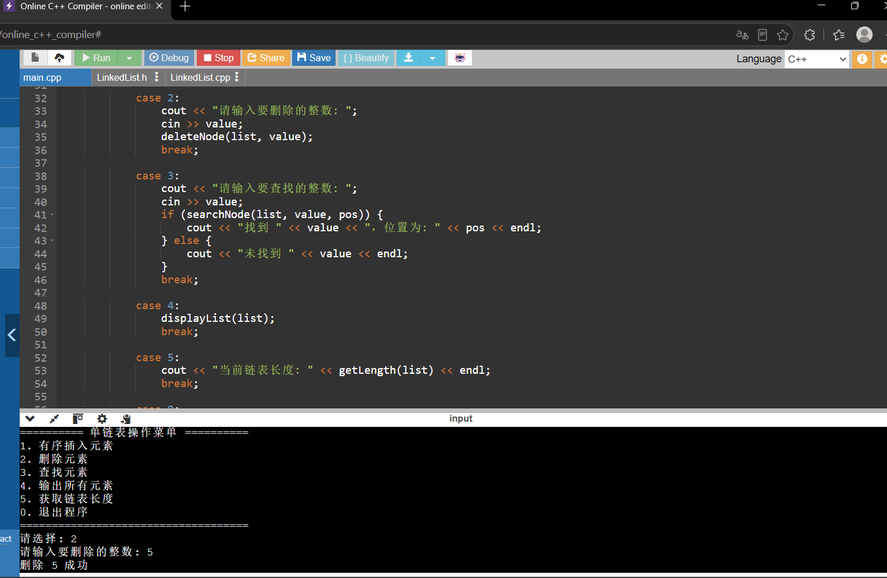
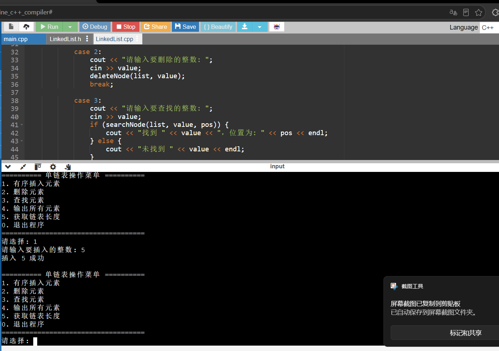
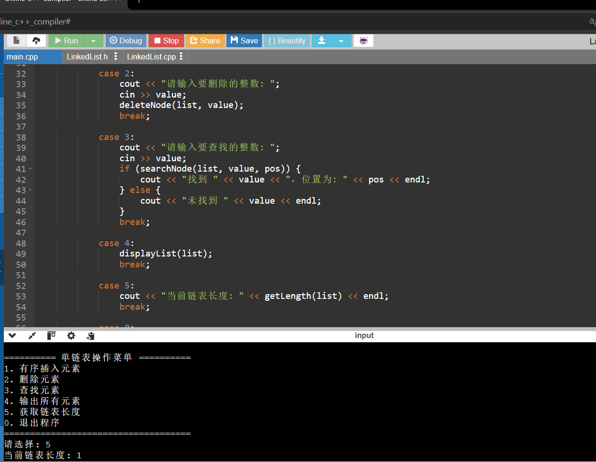
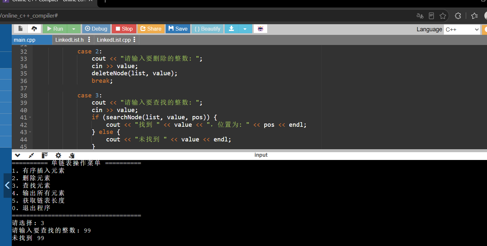

# 带头结点有序单链表 C++实现
> 数据结构课程实验，实现带头结点单链表的各类基础操作，链表存储int类型，支持有序插入。

## 项目简介
本项目实现带头结点的单链表，完成线性表常用操作，插入元素时维持链表从小到大有序，同时完成动态内存的申请与释放，避免内存泄漏。

## 实现功能
- 头插、尾插构建链表
- **有序插入**：保持链表升序，自动去重，不插入重复数值
- 删除指定数值结点
- 查找元素，返回元素所在位置
- 获取链表结点数量（链表长度）
- 遍历输出全部链表元素
- 销毁链表，释放全部动态内存

## 函数调用关系
> 完整源代码：存放在仓库 src/ 目录下（LinkedList.h、LinkedList.cpp、main.cpp）
>
## 运行截图

